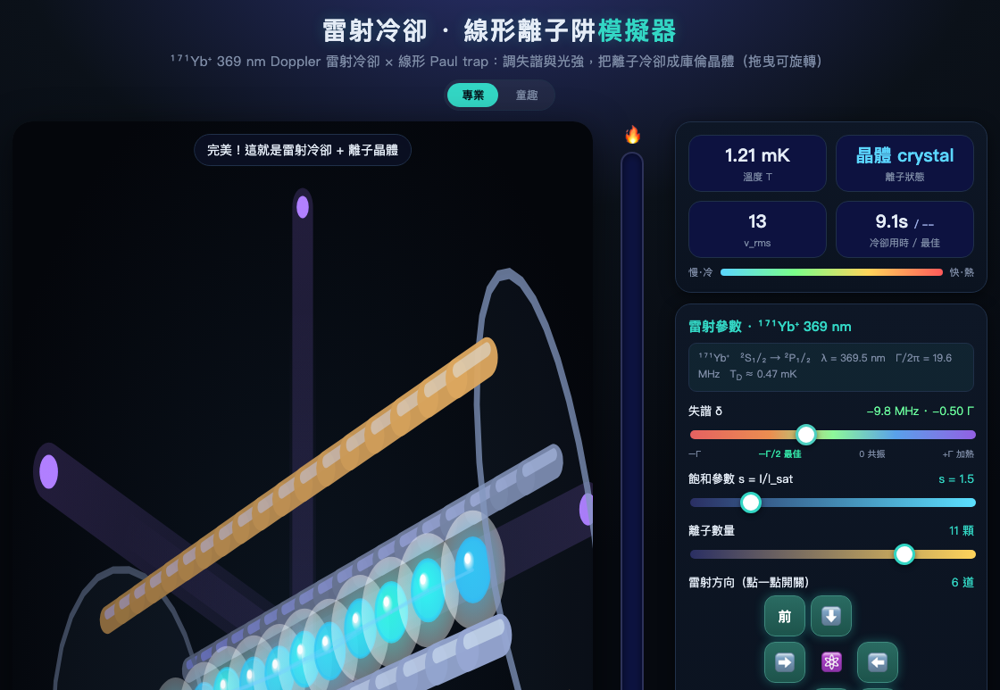

# ❄️ 雷射冷凍離子大作戰

一個給**國小生**玩的網頁互動遊戲，用「玩」的方式體驗離子阱裡的**都普勒雷射冷卻 (Doppler laser cooling)**：
調整雷射參數，把跑來跑去的高溫離子「凍」起來，挑戰排出漂亮的**離子晶體**！

### 🌐 線上遊玩 → **https://hhritrappedionlab.github.io/IonSimulation/**

（手機 / 平板 / 電腦皆可，免安裝；專業版含 ¹⁷¹Yb⁺ 369 nm、Paul trap RF/DC 與 micromotion）



> **立體 3D 版**：離子懸浮在真實「線形 Paul trap」的 **4 根電極棒 + 兩端端蓋**正中央，冷卻後排成一條**線形離子鏈**（中央較密、兩端較疏）。**拖曳畫面可 360° 旋轉**看立體。
> 右上角可一鍵切換 **專業（科研儀器風，預設）／ 童趣（可愛版）** 兩種外觀。

---

## 🚀 怎麼開始

直接用瀏覽器打開 **`index.html`** 即可（不需要網路、不需要安裝任何東西）。

- 雙擊 `index.html`，或把它拖進 Chrome / Edge / Safari。
- 適合電腦與**平板觸控**（可用手指拖曳旋轉視角、輕點戳離子）。
- 課堂單槍投影也 OK；建議用 Chrome。

> ⚠️ 請保持 `index.html` 和 `physics.js` 在**同一個資料夾**（前者會載入後者）。要分享給別人時，整個資料夾一起傳。

---

## 🎮 玩法

| 動作 | 說明 |
|---|---|
| 🔴🔵 **雷射顏色（失諧）** | 最關鍵的旋鈕！往「紅」一點點＝會冷卻；「對準」＝沒效；太「藍」＝反而加熱。 |
| 🔦 **雷射強度** | 雷射開多亮。調到 0 就是關燈，離子不會變冷。 |
| ⚛️ **離子數量** | 1～14 顆。越多顆，冷卻後排出的**離子鏈越長**。 |
| ⬅️➡️⬆️⬇️前後 **雷射方向** | 點開關**六個方向**（左右 ±x／上下 ±y／前後 ±z）。試試只開一邊會怎樣？ |
| ✨ **最佳設定** | 一鍵套用標準答案（紅失諧 + 六方向雷射全開）。 |
| 🔥 **加熱搖一搖** | 把離子重新搖熱，再挑戰一次。 |
| 🌀 **旋轉視角** | 拖曳畫面可 360° 轉動看立體；按「🌀 旋轉」鈕可開／關自動緩慢旋轉（預設關）。 |
| 👆 **輕點離子** | 在離子上輕點一下會「戳」它一下（局部加熱）。 |
| 🎨 **專業 / 童趣** | 右上角切換顯示風格。**專業**（預設）：科研儀器風，**¹⁷¹Yb⁺ 369 nm** 紫外雷射、失諧顯示 **MHz / Γ**、溫度 **mK**、電極分 **RF / 接地 / DC 端蓋**；**童趣**：可愛笑臉、彩帶慶祝、紅藍變色雷射，適合小朋友。 |
| ⚡ **阱模型（專業版）** | 切換 **贗位能 (secular)**（預設、快）或 **真實 RF**（顯式積分時變四極場 → 出現 **micromotion**）。RF 模式可調 **RF 頻率 Ω**、**RF 電壓 V_RF**、**DC 端蓋電壓 U_DC**、**雜散 DC 場**，並即時算出 **secular 頻率 ω_r／ω_z**、Mathieu **(a, q)** 與穩定性。把離子推離 RF 零點即可看到 **excess micromotion**（冷晶體也抖），示範「微運動補償」；q 拉過 0.908 會標示不穩定、離子流失。 |

**目標**：讓離子冷到幾乎不動（💎 晶體狀態）並維持住，就會跳出「結晶成功 🎉」。
畫面會記錄你的**冷卻用時**與**最佳紀錄**，可以和同學比賽！

---

## 👀 畫面在演什麼

- **立體電極**：畫面中的 **4 根金屬棒 + 兩端端蓋**就是真實線形 Paul trap 的電極；離子懸浮在正中央軸線上。近的粗而亮、遠的細而暗 → 立體深度感（拖曳可旋轉確認）。
- **離子的顏色＝溫度**：紅／橘＝又快又熱🔥；藍／青＝又慢又冷❄️。
- **離子的表情**：熱的時候張大嘴、冒汗、暈頭轉向；冷的時候閉眼微笑、睡著。
- **尾巴**：跑越快尾巴越長。
- **雷射光束顏色**：紅失諧時偏暖紅、對準時偏綠、藍失諧時偏藍紫。
- **連線**：快結晶時，離子之間會出現淡藍色連線，凸顯排列。
- **溫度曲線圖**：即時記錄溫度變化，看著它往下掉超有成就感。

---

## 🧪 適合的課堂探究問題（給老師）

這個遊戲刻意做成可以「動手實驗」，建議讓學生自己發現規律：

1. **只調顏色**：固定其他不動，只滑動「雷射顏色」。什麼顏色離子變最冷？太藍會怎樣？
   （👉 帶出：紅失諧才會冷卻；藍失諧會加熱。）
2. **只開一個方向的雷射**：離子會完全停下來嗎？為什麼？
   （👉 帶出：要從不同方向打，才能停下各個方向的晃動。）
3. **強度的影響**：雷射越強冷得越快嗎？關掉雷射又如何？
4. **離子數量**：1 顆 vs 10 顆，冷下來後的排列有什麼不同？
   （👉 帶出：同性電荷互相排斥 → 離子晶體。）
5. **延伸**：為什麼離子沒辦法完全靜止？（👉 都普勒極限。）

對應的白話原理都寫在遊戲裡的 **「❓ 為什麼雷射可以讓離子變冷？」** 按鈕中。

---

## 🔬 背後的物理（給老師／進階）

模擬是**真 3D**（每顆離子有 x/y/z），採用**任意「遊戲單位」**但忠於真實機制：

- **3D 諧波線形阱**：`a = −(Kx·x, Ky·y, Kz·z)`。
  遊戲預設 `trapKx=1`（弱·軸向）、`trapKy=trapKz=30`（強·徑向）→ 離子沿 x 軸排成 **立體線形離子鏈**，且**中央間距較密、兩端較疏**（與真實線形 Paul trap 的平衡位置一致）；徑向束縛若調弱會出現 **linear→zigzag** 轉變。
  - 想看 3D 團狀 Coulomb crystal：把 `physics.js` 的 `trapKx/Ky/Kz` 設成相等即可。
  - **真實 RF 模式**（`trapModel:'rf'`）：顯式積分 Mathieu 時變四極場 `ÿ = (Kx/2 − A·cosΩt)·y + 雜散場`。直接設定 RF 頻率 `Ω`、RF 電壓 `A∝V_RF`、DC 電壓 `Kx∝U_DC`，secular 頻率由它們算出：`ω_r = √(A²/2Ω² − Kx/2)`、`ω_z = √Kx`、`q = 2A/Ω²`、`a = 4Kx/Ω²`（見 `Physics.secularFreqs()`）。離 RF 零點越遠 micromotion 越大（`x_mm ≈ (q/2)·ρ`）；零點上幾乎為零。詳見 `physics-and-implementation.html` §6。
- **3D 庫倫排斥**（軟化）：`a += coulomb · r̂ / r²`，夠冷時自組成 Coulomb crystal。
- **都普勒雷射冷卻**（6 道光束 ±x/±y/±z）：每道光束散射率採勞侖茲線型
  `R(v) ∝ s / (1 + s + (2δ′/Γ)²)`，其中離子實際感受到的失諧
  `δ′ = δ − k·(n·v)`（都普勒位移）。沿光束方向 n 施加平均光壓力，並加上正比於
  `√(散射率)` 的 **3D 隨機反衝**（自發輻射）作為加熱項 → 形成**都普勒冷卻極限**（離子永遠有殘餘抖動）。
  - 紅失諧 `δ<0`：迎面而來的離子被選擇性散射、被推回 → 阻尼 → 冷卻。
  - 藍失諧 `δ>0`：反阻尼 → 加熱（遊戲中真的會看到離子越來越快）。
- 真實對應：最佳冷卻在 `δ = −Γ/2` 附近；遊戲預設 `δ = −0.5Γ`。
- **專業版物理單位**（以 ¹⁷¹Yb⁺ 369 nm 冷卻躍遷錨定）：`Γ/2π = 19.6 MHz`，故失諧顯示 `δ[MHz] = δ[Γ] × 19.6`（預設 −0.5Γ = −9.8 MHz）；溫度以都普勒極限 `T_D = ħΓ/2k_B ≈ 0.47 mK` 為地板換算（`T ∝ v_rms²`，鎖在 T_D 以上，無法低於極限）；飽和參數 `s = I/I_sat`。電極為線形 Paul trap：**對角一對 RF、另一對接地，兩端 DC 端蓋**。
  - 雷射在專業版固定畫成 **369 nm 藍紫色**（真實雷射不會因為 ~10 MHz 失諧而改變可見顏色）；童趣版才用紅↔藍變色來教「紅失諧冷卻」。

> 為了適合國小，數值（捕捉速度、極限溫度、晶體間距）已調成「好看、好玩、可恢復」，
> 並非真實 SI 數量級。想更接近真實，可調 `physics.js` 內的常數（見下）。

---

## 🛠️ 檔案結構與測試

```
laser-cooling-game/
├── index.html                      # 遊戲本體（介面 + 3D 渲染），載入 physics.js
├── physics.js                      # 物理模擬核心（瀏覽器 / Node 雙用）
├── physics-and-implementation.html # 詳細說明：物理原理 ↔ 程式實作（公式 + 程式片段）
├── test/
│   └── physics.test.cjs            # 物理單元測試（冷卻/加熱/穩定性/線形鏈）
└── README.md
```

> 想看完整的**物理推導與實作方法**（Doppler 冷卻力、都普勒極限、Paul trap 贗位能、平均光壓+反衝擴散的數值模型、3D 投影…），打開 **`physics-and-implementation.html`**，或從遊戲右上角的「📄 物理原理與實作說明」進入。

跑測試（需要 Node.js）：

```bash
node test/physics.test.cjs
```

會驗證：紅失諧會冷卻、藍失諧會加熱、共振冷卻效果差、會形成不重疊的離子晶體、
極端參數下不會數值爆炸等。

### 想微調手感？

打開 `physics.js` 最上面的 `DEFAULTS`：

| 常數 | 意義 | 調大會怎樣 |
|---|---|---|
| `forceScale` | 光壓力大小 | 冷卻更快 |
| `noiseAmp` | 反衝雜訊 | 極限溫度更高（離子抖更兇、較難結晶） |
| `dopplerCoef` | 都普勒靈敏度 `k` | 捕捉速度變小（高速離子較難被冷） |
| `trapKx`／`trapKy`／`trapKz` | 阱在 x／y／z 三軸的束縛力 | 三者相等→3D 團狀；`trapKy=trapKz≫trapKx`→立體線形鏈 |
| `coulomb` | 離子互斥強度 | 晶體間距更大 |
| `maxSpeed` | 速度上限 | 可以變更熱（但再熱也要冷得回來） |

> 改完 `physics.js` 後，記得重跑 `node test/physics.test.cjs` 確認沒壞。

---

## 💡 設計理念

「溫度＝晃動快慢」「光會推東西」「只推迎面來的離子」——
用看得到的離子表情、顏色、晶體與即時溫度曲線，把抽象的雷射冷卻變成可以動手玩的遊戲。
這正是真實實驗室用來冷卻離子、進而打造**量子電腦**的關鍵技術。
